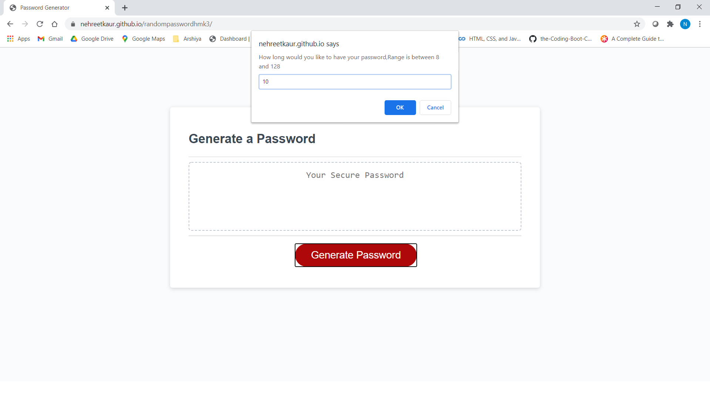
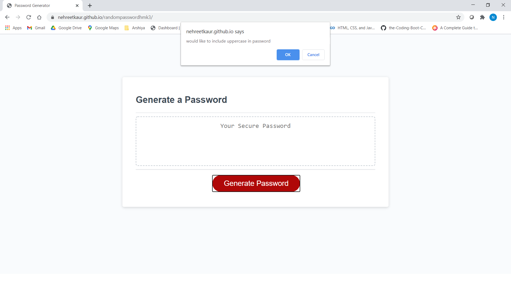

# Description
**This** is my **Random Password Generaaator** project.
**Build** **generator function** in  **_style.js_**.
Full attempt to keep my **code** **precise**  .
Also, added comments for clarity.

# **Languages used** :-
**HTML**

**CSS**

**Javascript**
## **Text Editor** :-

**Visual Studio Code**

## **OUTPUT**
### User can make choices from the provided **prompts**
#### User can make choices from:-
#### **Numbers**

#### **Special characters**

#### **Upper case**

#### **Lower case**
**IN addition** user can also decide on the length of the password with in the provided **Range**. **Choice** of _length_ of the password should be entered in numbers only.User have to **choose/select** **one** entry to continue to generate **_random password_** .

## Providing some screenshots

### **Links**

[**Github Repository**](https://github.com/nehreetkaur/randompasswordhmk3.git)

[**Github Deployed Application**](https://nehreetkaur.github.io/randompasswordhmk3/)
